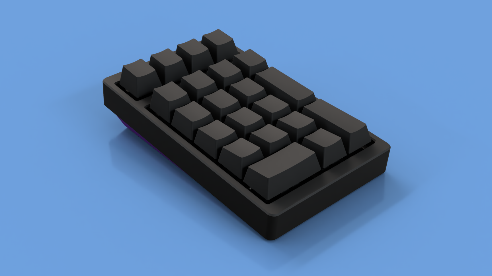
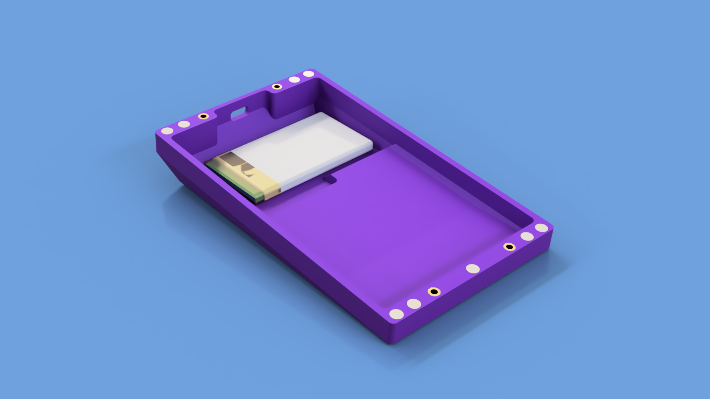
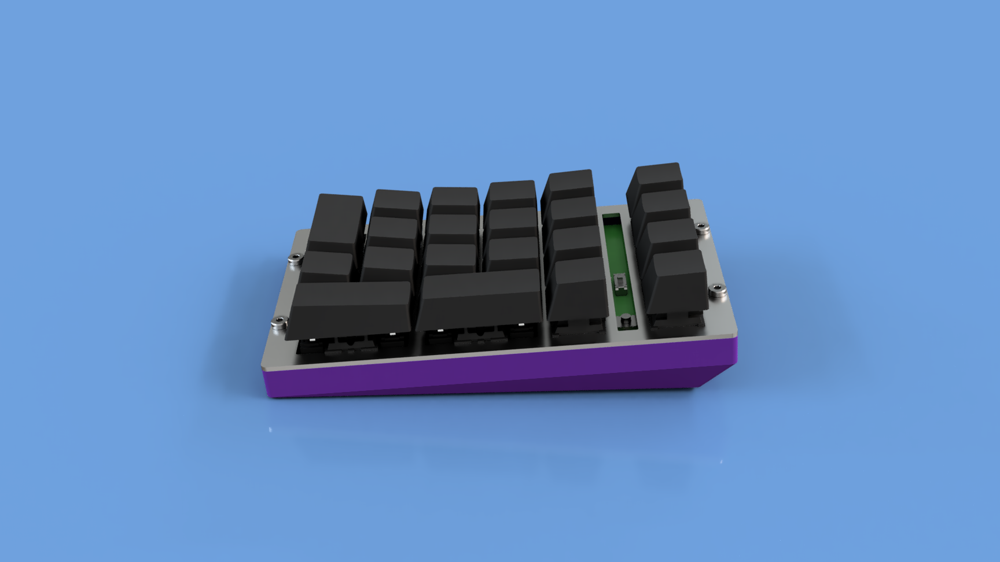

# NumBLE Wireless Numpad

NumBLE is a wireless, 21-key numpad based on the [Nordic nNRF52840 SoC](https://www.nordicsemi.com/Products/Low-power-short-range-wireless/nRF52840).
It also supports 22-key and 24-key layouts, and the top-left key can be replaced
with a rotary encoder. It is powered by up to an 1200 mAh Li-Po battery, and can
also be used wired with a USB-C cable.

## Hardware

The PCB is designed to be hand-solderable. See the KiCAD design files in the
`pcb` folder (requires KiCAD 5.99 nightly builds) for more details. The PCB
supports an optional fuel gauge IC, which provides more accurate battery status
but requires reflow soldering.

See the `case` folder for the design files for the design files for the case and
plate. The case is 3D printed in two parts, and the plate is attached to the bottom
with four bolts into threaded inserts. The top attaches to the bottom with magnets
glued into both halves.

Removing the top of the case exposes power and reset switches. The power switch
only affects the numpad when in wireless mode. When wired, it is always powered
and will charge the battery regardless of the position of the power switch.

## Software

NumBLE runs [ZMK Firmware](https://zmkfirmware.dev/). There are other firmwares
that can run on an nRF52, and I will be happy to answer questions on setting them
up for NumBLE, but I do not plan to personally support them.

The bootloader is built with [my fork of Adafruit's nRF52 bootloader](https://github.com/joelspadin/Adafruit_nRF52_Bootloader).

The bootloader included in the releases does not contain the SoftDevice, as
Zephyr does not need it. If you'd like to run firmware that requires the SoftDevice,
you can either compile the bootloader yourself, or let me know and I can include
multiple versions of the bootloader in releases.

## Renders

## Status

Some parts of the hardware have not yet been fully tested.

| Feature                           | Status                                                  |
| --------------------------------- | ------------------------------------------------------- |
| 21-key layout                     | Working                                                 |
| 22-key layout                     | Untested                                                |
| 24-key layout                     | Untested                                                |
| Encoder                           | Untested                                                |
| Battery reporting with fuel gauge | Partially tested, requires driver updates in Zephyr 2.6 |
| Voltage-based battery reporting   | Software work in progress                               |

## Credits

The case was designed with [Fusion 360](https://www.autodesk.com/products/fusion-360).
Renders use the [Interior HDRI free pack](https://www.maximeroz.com/hdri-free-pack)
by Maxime Roz.

The KiCAD project uses symbols and footprints from:

- [ai03-2725/MX_Alps_Hybrid](https://github.com/ai03-2725/MX_Alps_Hybrid)
- [ai03-2725/Type-C.pretty](https://github.com/ai03-2725/Type-C.pretty)
- [joric/nrfmicro](https://github.com/joric/nrfmicro)